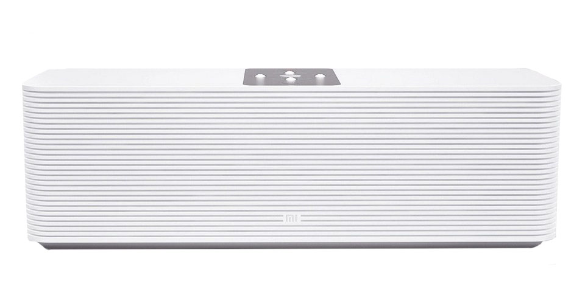

# Xiaomi Mi Internet Speaker



Replacement OpenSSL libraries for Xiaomi Mi Internet Speaker providing compatibility with HTTPS servers that use **Elliptic Curve Cryptography (ECC)** certificates and ECDHE/ECDSA-based TLS cipher suites.

## Overview

The original OpenSSL version shipped with Xiaomi Mi Internet Speaker lacks support for a number of modern TLS features required by many streaming services. As a result, TLS negotiation fails during the handshake when connecting to servers using elliptic-curve cryptography.

This repository provides replacement OpenSSL libraries that enable successful TLS handshakes with such servers, restoring the ability to stream audio from HTTPS endpoints that were previously inaccessible.

## Installation

Copy the [`libopenssl_1.0.2f-1_meson.ipk`](`libopenssl_1.0.2f-1_meson.ipk`) package to the target device and install it with:

```sh
opkg install libopenssl_1.0.2f-1_meson.ipk --force-downgrade
```

## Building

Instructions for building the package from source are available in [build.md](build.txt)
